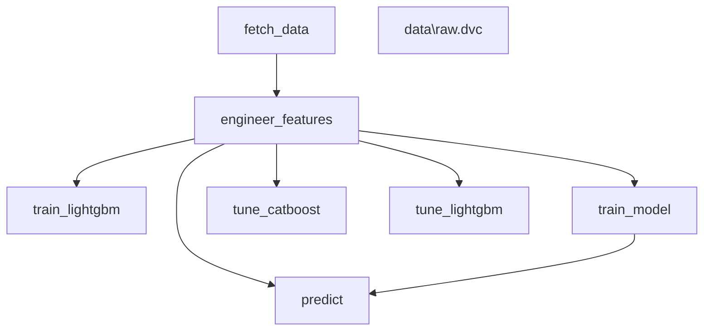

```mermaid
flowchart TD
	node1["engineer_features"]
	node2["fetch_data"]
	node3["predict"]
	node4["train_lightgbm"]
	node5["train_model"]
	node6["tune_catboost"]
	node7["tune_lightgbm"]
	node1-->node3
	node1-->node4
	node1-->node5
	node1-->node6
	node1-->node7
	node2-->node1
	node5-->node3
	node8["data\raw.dvc"]
```