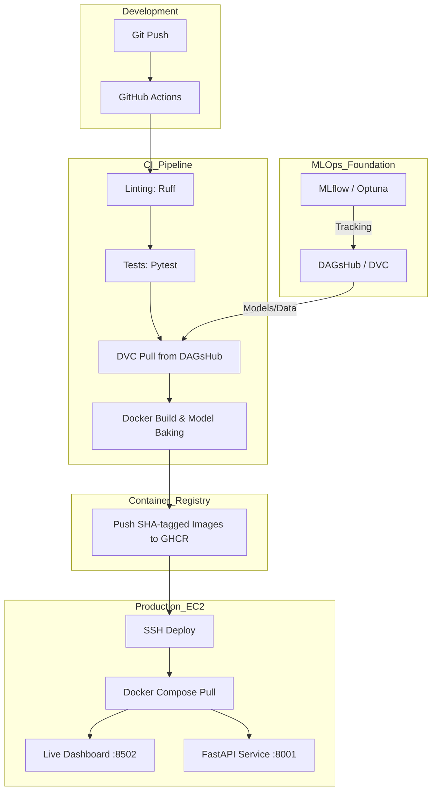

# 🚚 Ecommerce Delivery Delay Prediction

[](https://github.com/anixes/ecommerce_delay_prediction/actions)
[](https://dvc.org)
[](http://13.204.212.148:8502)

**Public URL**: <http://13.204.212.148:8502>

> [!TIP]
> **Mobile Users**: If the link doesn't open from the GitHub app, try opening it in your mobile browser (Chrome/Safari) directly: **<http://13.204.212.148:8502>**

## 📖 Overview

A complete end-to-end Machine Learning system for predicting delivery delays in the **Olist Brazilian E-Commerce** marketplace. The project demonstrates a full-lifecycle "Push-to-Deploy" pipeline, integrating advanced machine learning, data engineering, and automated cloud infrastructure.

---

## 📐 System Architecture

The system follows a modern MLOps architecture, ensuring reproducibility and scalability.



---

## 🏗️ Technical Component Overview

The application is composed of three decoupled logical components:

1. **Machine Learning Pipeline (`delivery_delay_prediction/`)**
   - Built with **CatBoost** for optimal handling of categorical features (states, categories).
   - **Hyperparameter Tuning**: Powered by **Optuna** for Bayesian search.
   - **Versioning**: Model artifacts (`.cbm`) are version-controlled via **DVC** and hosted on **DAGsHub**.

2. **Backend API (`src/api/`)**
   - High-performance **FastAPI** service serving the pre-trained CatBoost model.
   - Implements robust Pydantic schemas for data validation.
   - Deterministic image tagging (Git SHA) ensures the running code matches the specific commit.

3. **Frontend Dashboard (`src/dashboard/`)**
   - Interactive UI built with **Streamlit** for real-time risk assessment.
   - Features scenario presets (Holiday Rush, Long Distance) to demonstrate model sensitivity.
   - Communicates with the FastAPI backend over internal Docker networking.

---

## 🛤️ Training Lifecycle & MLOps

### 1. Data Versioning & Storage

We use **DVC** to manage large datasets and binary models without bloating the Git history.

- **Remote**: DAGsHub (S3-compatible storage).
- **Parity**: Git Commits are linked 1:1 with DVC data snapshots.

### 2. Experiment Tracking

Training experiments are tracked via **MLflow**, capturing:

- **Metrics**: PR-AUC (Primary), F1-Score, RMSE.
- **Parameters**: Best hyperparameters found by Optuna.
- **Artifacts**: Feature importance plots and model versions.

---

## 🔌 API Contract (V1)

The backend provides a stable REST interface for prediction services.

### `POST /predict`

Estimates the probability of a delivery being late.

**Request Body (`application/json`):**

```json
{
  "shipping_distance_km": 150.0,
  "estimated_lead_time_days": 12.0,
  "seller_state": "SP",
  "customer_state": "SP",
  "purchase_hour": 10,
  "purchase_day_of_week": 1
}
```

**Response Body:**

```json
{
  "is_late_probability": 0.12,
  "prediction": 0,
  "model_version": "5d594c6"
}
```

---

## 🚀 How to Run Locally

### Approach 1: The Easy Way (Docker Compose)

*Best for running the entire stack (API + Dashboard) instantly.*

```bash
# Clone the repository
git clone https://github.com/anixes/ecommerce_delay_prediction.git
cd ecommerce_delay_prediction

# Start the services
docker compose up --build
```

- 🏠 **Dashboard**: `http://localhost:8502`
- ⚙️ **FastAPI Docs**: `http://localhost:8001/docs`

### Approach 2: Manual Development Mode

*Best for actively modifying code or training models.*

```bash
# Setup environment
python -m venv venv
source venv/bin/activate  # venv\Scripts\activate on Windows
pip install -r requirements.txt

# Start API
uvicorn src.api.main:app --reload --port 8000

# Start Dashboard (in new terminal)
streamlit run src/dashboard/app.py --server.port 8501
```

---

## 🧪 Testing and CI/CD

Continuous Integration is configured via **GitHub Actions** with a dual-workflow strategy:

1. **`ci.yml` (Checks)**: Runs on every push to any branch.
    - **Linting**: `Ruff` checks for code quality and style.
    - **Smoke Build**: Verifies that the Docker context is valid and dependencies install correctly.
2. **`deploy.yml` (Production)**: Runs only on push to `main`.
    - **DVC Pull**: Dynamically pulls the heavy model artifacts into the build context.
    - **Registry**: Pushes Git-SHA and `:latest` tagged images to **GitHub Container Registry (GHCR)**.
    - **CD**: Automated SSH deployment to AWS EC2.

---

## ⚡ MLOps Infrastructure & Efficiency

The project is optimized for "Lean Production" on a CPU-only host:

- **"Slim-ML" Architecture**: Uses `python:3.11-slim` with multi-stage builds.
- **GPU Bloat Removal**: Automated stripping of `nvidia-*`, `cuda-*`, and `nccl-*` libraries during build, reducing the attack surface and disk footprint.
- **Disk Optimization**: A comprehensive `.dockerignore` excludes ~2GB of training artifacts (`data/`, `mlruns/`, etc.) from the production image.
- **Self-Cleaning Deployment**: The deployment script automatically runs `docker image prune -f` after every update to keep the EC2 disk healthy.

---

## 🗺️ Roadmap (v2)

- **Live Monitoring Dashboard**: Integrate Grafana/Prometheus to monitor model drift and API latency in real-time.
- **Seldon / Kubernetes Migration**: Transition from Docker Compose to a more robust orchestration for handling traffic spikes.
- **Feature Store**: Implement a feature store to ensure consistency between training and serving features.

---
*Created for portfolio purposes. Demonstrates skills in: Data Engineering, ML Modeling, Docker, CI/CD, and MLOps.*
