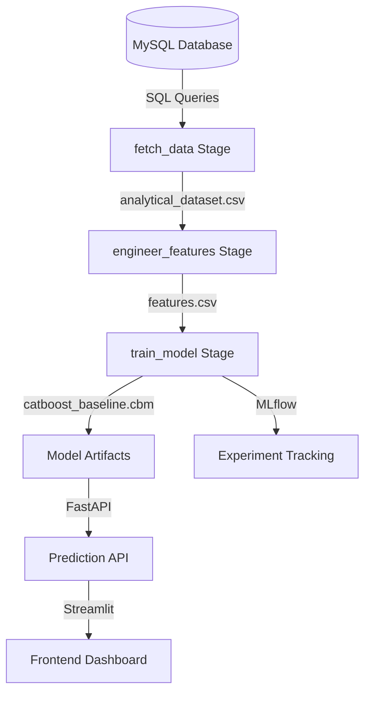

# Project Architecture: E-Commerce Delivery Delay Prediction

## Workflow Overview
This project follows a modular machine learning pipeline managed by **DVC** and **MLflow**. The data flows from a relational MySQL database into a structured ML pipeline.

## Core Components

### 1. Data Engineering (`delivery_delay_prediction/dataset.py`)
- Connects to a MySQL database using SQLAlchemy.
- Executes complex SQL joins across 9 tables (Orders, Customers, Sellers, etc.).
- Produces a denormalized analytical dataset.

### 2. Feature Engineering (`delivery_delay_prediction/features.py`)
- Transforms raw SQL outputs into ML-ready features.
- Handles temporal encoding, historical aggregations, and categorical mappings.

### 3. Model Training (`delivery_delay_prediction/train.py`)
- Uses **CatBoost** (or LightGBM) for binary classification.
- Performs hyperparameter optimization via **Optuna**.
- Logs all parameters, metrics (ROC-AUC, F1, Recall), and model artifacts to **MLflow**.

### 4. Pipeline Management (`dvc.yaml`)
- Every stage is reproducible via `dvc repro`.
- Dependencies and outputs are tracked to ensure data consistency.

### 5. Deployment
- **FastAPI**: Provides `/predict` endpoints for real-time inference.
- **Streamlit**: An interactive interface for business users to visualize risk scores.

## Quality Control
- **Linting**: Managed by `ruff`.
- **Typing**: Follows standard Python typing conventions.
- **Testing**: Managed via `pytest`.
